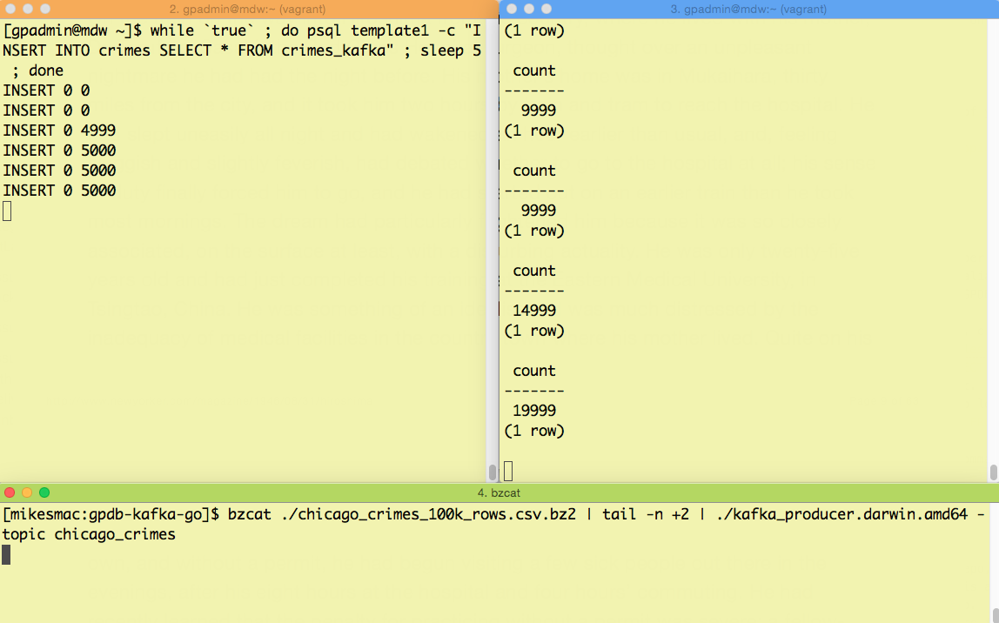
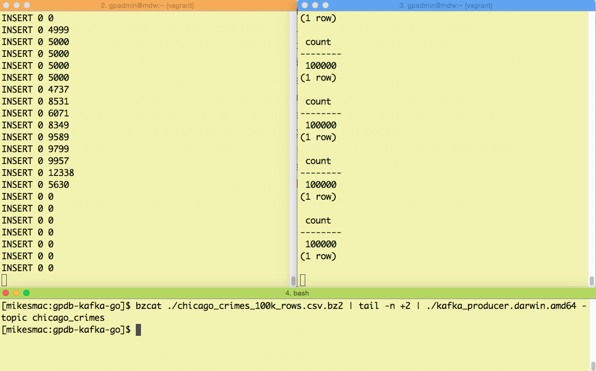

# gpdb-kafka-go

This is a simple Kafka consumer to enable Greenplum Database (GPDB) to load data from
a Kafka topic using GPDB's _external web table_ capability.  This client is written
in Go.

## What is Kafka?
_Kafka is a distributed, partitioned, replicated commit log service. It provides the functionality of a messaging system, but with a unique design._ See the [Kafka docs](http://kafka.apache.org/documentation.html#introduction) for a nice introduction.

## What is GPDB?
GPDB is an open source massively parallel processing (MPP) relational database.  Using its
[_external tables_](http://gpdb.docs.pivotal.io/4370/ref_guide/sql_commands/CREATE_EXTERNAL_TABLE.html)
feature, it is able to load massive amounts of data very efficiently by exploiting its parallel
architecture.  This data can be in files on ETL hosts, within HDFS, or in Amazon S3.  This Kafka
consumer will utilize GPDB _external web tables_, since they are able to run an executable program,
in parallel, to ingest data.

## Why Go?
* I am trying to learn Go and Kafka (maybe this is also a caveat).
* Go builds a single, statically linked binary, which has all its dependencies built in, which makes it simpler to install than, say, a Python or Java program.

## What's Required to Get This Running?
* A Running Kafka installation.  I followed the [Quick Start](http://kafka.apache.org/07/quickstart.html).  My installation directory was `./kafka_2.11-0.10.0.0`, so this will appear in the Kafka commands, below.
* A [Go installation](https://golang.org/doc/install)
* An installation of GPDB.  The [GPDB Sandbox VM](https://network.pivotal.io/products/pivotal-gpdb#/releases/1683/file_groups/411) would work just fine for trying this out.
* The [Go source file](./kafka_consumer.go) for the Kafka consumer

## Try Out an Example
This example will involve creating a single table, _crimes_, within GPDB and loading 100,000 rows through Kafka.  This data set is accessible [here](https://data.cityofchicago.org/Public-Safety/Crimes-2001-to-present/ijzp-q8t2/data) but, for this example, there is a small subset stored in S3 (see below).  In this example, I envision running one terminal on the local machine and another on the GPDB master host.

1. Resolve the dependencies: `go get github.com/wvanbergen/kafka/consumergroup github.com/Shopify/sarama`
1. Build the executable: `go build kafka_consumer.go`
1. Install the resulting executable, kafka_consumer, into the `$HOME` directory of the gpadmin user on each of your GPDB segment hosts (or, just onto the single host if you are using the GPDB Sandbox VM).
1. Create a _topic_ in Kafka, with two _partitions_: `./kafka_2.11-0.10.0.0/bin/kafka-topics.sh --create --topic chicago_crimes --replication-factor 1 --partitions 2 --zookeeper localhost:2181`
1. Upon success, you should be able to see it in the output when you list the topics: `./kafka_2.11-0.10.0.0/bin/kafka-topics.sh --list --zookeeper localhost:2181`
1. Log in to your GPDB master host, as user _gpadmin_.
1. Ensure GPDB is running.  You can start it by typing `gpstart -a`, as the _gpadmin_ user.
1. To make the external table definition constant, so there is no need to edit its SQL, determine the IP number of the host running your Kafka installation's Zookeeper server, and add an entry for this IP in your `/etc/hosts` file, aliased to the host name _my_zk_host_.  In my setup, it would look like this: `172.16.1.1 my_zk_host`.  If you are running GPDB across more than one host, ensure you copy this `/etc/hosts` file to each segment host.
1. Using the [SQL file containing the DDL for these tables](./gpdb_create_tables.sql), and the _psql_ client, create the two tables (one is the table to load; the other is the external table): `psql template1 -f ./gpdb_create_tables.sql`
1. At this point, you should be able to run a quick query to verify this is working: `psql template1 -c "SELECT * FROM crimes_kafka"`, which should run but return zero rows of output, since the Kafka topic is empty at this point.
1. If all is well, you can start a periodic load there.  For the purposes of this demo, just run the query to load the table every five seconds: `[gpadmin@mdw ~]$ while `true` ; do psql template1 -c "INSERT INTO crimes SELECT * FROM crimes_kafka" ; sleep 5 ; done` (the output should be `INSERT 0 0`, showing no data being inserted).
1. In a separate terminal window, also logged into the GPDB master host, as _gpadmin_, start the following command so you're able to track the progress of the load from Kafka: `while `true` ; do psql template1 -c "SELECT COUNT(*) FROM crimes" ; sleep 5 ; done`
1. Back at the terminal on your laptop, grab the [sample data file](https://s3.amazonaws.com/goddard.bds.datasets/chicago_crimes_100k_rows.csv.bz2) (MD5: 6f05a6ea98576eff13ff16b0da9559ec).  This contains 100,000 lines, plus a header (the first line).
1. You'll need a way to produce data into the topic you created earlier, using this data set.  Within this repo, there is a [source file](./kafka_producer.go), also in Go, that you can compile and run.  If you are using OS X, there is a [pre-compiled binary](./kafka_producer.darwin.amd64) you can use.  That is the one we'll use in the next step.  This program just reads its stdin and produces to the given Kafka topic.  It loads a batch of 5000 rows, then waits for five seconds before sending the next batch.
1. Finally, kick off the load of the data file into the Kafka topic: `bzcat ./chicago_crimes_100k_rows.csv.bz2 | tail -n +2 | ./kafka_producer.darwin.amd64 -topic chicago_crimes` (the `tail -n +2` just skips the header line).

These images show the action going on within each of the three terminal sessions during this data load process
The first shows the situation shortly after the load into Kafka begins, and the second shows all 100k rows loaded
into the GPDB table.

